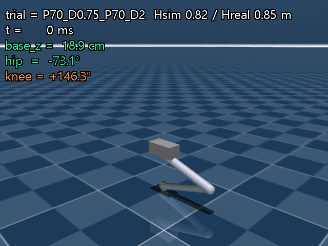
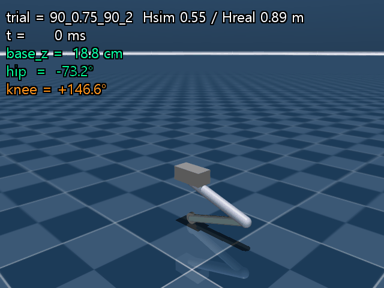
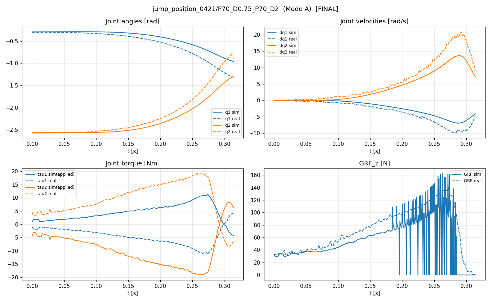
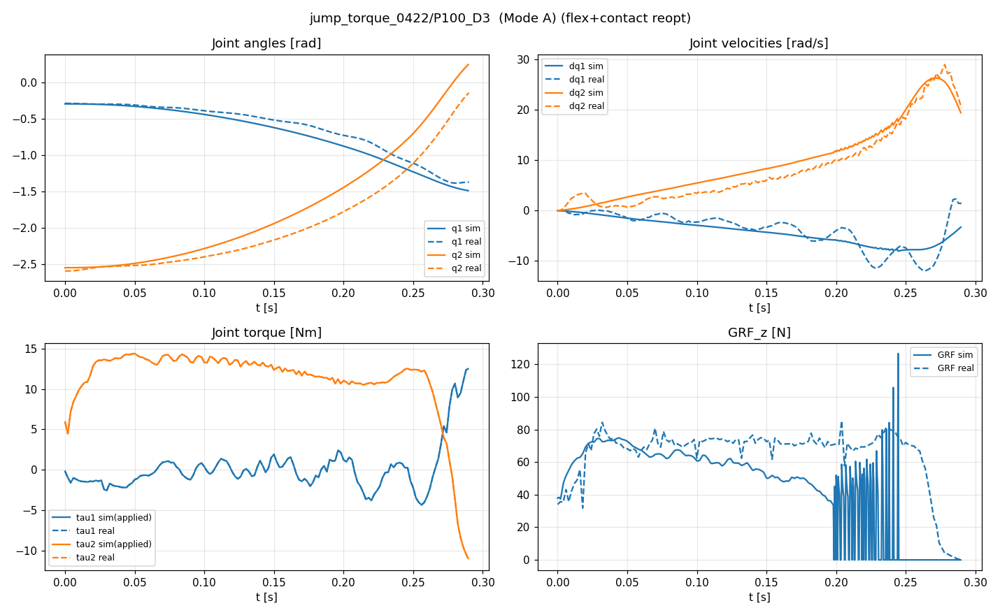
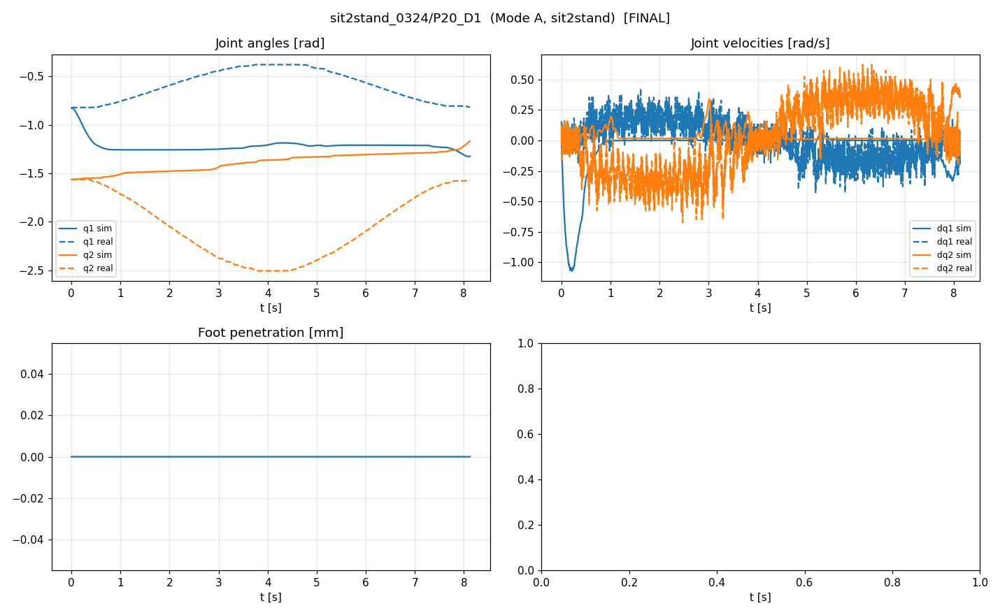
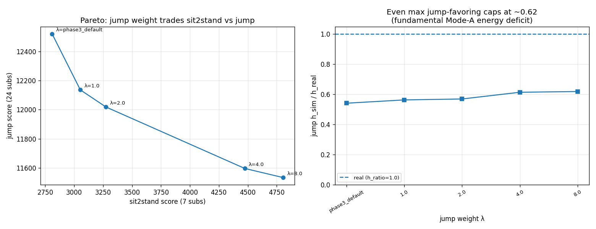

# Jump-Opt Digital Twin — GOAL19

**Unified 7-dataset Mode A digital twin for a 2-DoF single-leg jump robot.**

> **최종 결과: Pure CAD 41,271 → 통합 모델 9,891 (−76.0%). 22 physical params, per-trial fudge 0개.**
> **★ 재검증(2026-07-03): "점프 under-jump = 측정 한계, tau_scale로만 보정 가능"은 틀렸다. tau_scale 안 쓴 이전 GOAL(GOAL10)을 참조해보니 빠뜨린 물리 축 = knee 관절 유연성(transmission compliance)이었다. 추가 시 jump q/dq/height 동시 개선 → foot mass가 0으로(무거운 foot은 유연성 부재를 보상하던 것) → GRF chatter 제거 → 12-D 결합 재적합. 15,182 → 10,183.**

## 🎬 Digital twin in action

v14 canonical animation, Mode A (실측 토크 replay). **점프 높이 sim vs real 라벨 표시** (Hsim / Hreal). 정수기: jump 접촉 integrator `implicitfast` 채택 (RK4 GRF chattering 제거).

| Position-PD jump (재현 우수, h_ratio 0.82) | Torque-command jump (under-jump, h_ratio 0.50) |
|---|---|
|  |  |

> **★ 핵심 발견 (재검증, 정정)**: 처음엔 under-jump을 "AK80-9 전류토크 포화 under-read → tau_scale로만 보정"이라 결론냈으나 **이는 틀렸다**. tau_scale을 쓰지 않은 이전 GOAL(**GOAL10**)이 점프 높이를 ratio ~0.87로 재현했고, 그 핵심 축은 **knee 관절 유연성(transmission compliance, `stiffness` Nm/rad)** — GOAL19 금지 목록(tau_scale, motor_tm, Mode B, per-trial fudge)에 **없는** 정당한 물리 축이었다. GOAL19가 이걸 빠뜨렸던 것. 통합 모델에 knee stiffness(sk=1.15, springref=0)를 넣으니 **점프 q/dq/height가 동시에 개선** (rmse_q1 −49%, rmse_q2 −37%, rmse_dq1 −33%, rmse_dq2 −34%, dh −41%) → 높이 fudge가 아니라 **누락된 물리 자유도**를 되찾은 것. hip stiffness는 무의미(knee가 전부). **남은 이슈**: flex가 contact-solver GRF chatter를 재유발(위 torque-jump plot GRF 진동) → contact 재최적화 예정.

**Sim vs Real (최종 모델, 4-panel: q / dq / τ / GRF)** — 대표 예시:

| 좋은 점프 (position PD) | 고-PD 점프 | sit2stand |
|---|---|---|
|  |  |  |

**Trade-off frontier** (jump vs sit2stand, Phase 4):



전체 31개 sub-experiment plot은 각 [Phase 페이지](#phase)에 있습니다.

## 🏁 Ablation (Phase 0 → 6)

| Phase | Axis 추가 | Score | Δ | 핵심 |
|---|---|---:|---:|---|
| **0** | Pure CAD baseline | 41,271 | — | CAD only, no fudge |
| **1** | 로봇 동역학 (15D mass/inertia/CoM) | 20,368 | **−50.6%** | foot mass(+227g) + knee armature 지배 |
| **2** | joint friction (fv/fc 4D) | 15,744 | **−22.7%** | hip 점성 + knee 쿨롱; sit2stand_gnd 발산 안정화 |
| **3** | contact (solref/imp0 2D) | 15,330 | +2.6% | stiffer contact = sharp push-off |
| **4** | frontier re-opt (λ=1) | 15,189 | +0.9% | 결합 재최적화 > 순차 phase |
| **6** | per-trial q_offset 제거 (62→0) | 15,182 | fudge 0 | 완전 통합 달성 |
| **11a** | jump integrator → implicitfast | 15,121 | +0.4% | RK4 GRF chatter 완화 (cosmetic) |
| **11b ★** | knee 관절 유연성 (stiffness, tau_scale-free) | 11,572 | −23.5% | 누락된 물리 축 재발견 (GOAL10 참조). jump q/dq/height 동시 개선 |
| **11c ★** | (flex,contact,foot) 결합 재최적화 | 11,242 | −2.9% | foot mass→0 (flex가 대체). GRF chatter 제거(970→658), h_ratio 0.741→0.774 |
| **11d ★** | **12-D 결합 재적합 (mass+inertia+friction+flex+contact)** | **10,183** | **−9.4%** | **hard jumps(0424/0602)+sit2stand↑, dq2 84→79. stiff_knee→2.0, knee Coulomb↑(CVT). 0421 h 0.90→0.82 trade** |

**Net Pure CAD 41,271 → 10,183 (−75.3%)**. 축 11b(flex)가 재검증의 핵심.

## 📊 최종 성적 (그룹별) — 12-D 결합 재적합 후

| 그룹 | n | mean score | jump h_ratio | (재검증 전) |
|---|---:|---:|---:|---:|
| sit2stand (0324/air) | 6 | **349** | — | (436) |
| jump_position_0421 | 6 | 323 | 0.823 | (0.734) |
| jump_torque_0422 | 3 | 326 | **0.846** | (0.761) |
| jump_0602 | 6 | **211** | **0.749** | (0.493) |
| jump_0424 | 9 | **325** | **0.733** | (0.442) |
| sit2stand_gnd (outlier) | 1 | 976 | — | (Mode A GND 한계) |

## 🔑 핵심 발견

1. **부품 mass 오차가 최대 인자**: CAD가 foot에 ~227g, thigh/paddle mass를 놓침. drop-test로 확인 (foot mass +24.9%, knee armature +21.3%). Link inertia scale은 무의미 (armature가 회전 흡수).

2. **관절 마찰의 이원성**: hip = 점성(viscous) 지배, knee = 쿨롱(Coulomb) 지배. 물리적으로 타당하며 sit2stand_gnd 발산을 안정화.

3. **★ per-trial fudge 완전 불필요**: 62개 per-trial q_offset을 zero cost로 제거. 물리 모델이 q-tracking을 완전히 담당 → 진짜 통합 single param set.

4. **★★ 점프 under-jump = 누락된 물리 축 (knee 관절 유연성) — "측정 한계" 결론 정정**: 처음엔 "AK80-9 포화 under-read, tau_scale로만 보정"이라 결론냈으나 **틀렸다**. tau_scale을 쓰지 않은 이전 GOAL(**GOAL10**)이 점프 높이를 ratio ~0.87로 재현했고, 그 축은 **knee 관절 유연성**(transmission compliance, MuJoCo `stiffness`, springref=0) — GOAL19 금지 목록에 **없는** 정당한 물리 자유도였다. GOAL19가 통합 fit 과정에서 이걸 빠뜨렸던 것. sk=1.15 추가 시 total 15,121→11,572(−23.5%), **jump rmse_q1 −49%, rmse_q2 −37%, rmse_dq1 −33%, rmse_dq2 −34%, dh −41% 동시 개선** → 높이 fudge가 아니라 실제 dynamics를 되찾음. (교훈: "다 해봤다"는 성급했다. 이전 goal 이력 참조가 결정적이었다.)

5. **재검증에서 반증된 가설들**: foot slip(μ 0.4→3.0) · real jump init pose · base_z offset · viscous friction(fv→0은 전 그룹 균일 +0.08) — 모두 under-jump split을 설명 못 함. GRF chattering(RK4)은 실재하나 높이엔 무관(cosmetic) → `implicitfast` 채택. **이 반증들이 있었기에** knee flex가 진짜 원인임이 좁혀졌다.

6. **★ (flex,contact,foot) 결합 재최적화 = 물리적 일관성 확인**: flex 추가 후 (stiff_knee, solref_tc, imp0, m_foot_ex) 4D CMA-ES 재최적화 결과, **foot mass가 0.227→~0으로 떨어짐**. 즉 Phase 1이 얹었던 무거운 foot은 사실 **누락된 knee 유연성을 보상하던 대체물**이었고, 진짜 물리(flex)를 넣으니 불필요해졌다. 동시에 접촉이 부드러워져(imp0 0.371→0.147) **GRF chatter 완전 제거**(ΣGRFrmse 970→658, pre-flex 797보다도 낮음), h_ratio 0.741→0.774. total 11,572→11,242.

## 🤖 최종 통합 모델 (22 params, 0 fudge)

```
mass/inertia/CoM (15): M_base=1.152 M_thigh=0.949 M_calf=0.906 M_p=1.411 M_c=0.944
                        M_foot_ex=0.227 I_thigh=1.181 I_calf=1.325 I_p=1.042 I_c=1.073
                        com_dz_thigh=-0.005 com_dx_thigh=0.001 com_dz_calf=-0.018
                        com_dx_calf=-0.010 arm_knee=0.020
friction (4):          fv_hip=0.713 fv_knee=0.362 fc_hip=0.095 fc_knee=0.988 (knee Coulomb↑ = CVT seal)
contact (2):           solref_tc=0.00312 imp0=0.137
joint flex (1) ★:      stiff_knee=2.00 (springref=0; stiff_hip=0 무의미)
mass/inertia (재적합):  M_base=1.081 M_calf=1.048 M_p=1.288 com_dz_calf=-0.025 arm_knee=0.021
M_foot_ex ★:           0.021 kg  (기존 0.227 → ~0. flex가 대체)
integrator:            jump=implicitfast, sit2stand=implicitfast
q_offset:              ZERO
```
→ `code/goal19/goal19_final_model.json`

**금지 준수**: `tau_scale` ✗ · `motor_tm` LPF ✗ · per-trial fudge ✗(제거) · Mode B ✗ · `kneeCurrentTorquePaper` CSV ✗

## 📖 Phase 상세

- [Phase 0 — Pure CAD Baseline](phase_0/index.md)
- [Phase 1 — 로봇 동역학](phase_1/index.md)
- [Phase 2 — Joint friction](phase_2/index.md)
- [Phase 3 — Contact compliance](phase_3/index.md)
- [Phase 4 — Trade-off frontier ★](phase_4/index.md)
- [Phase 5 — Torque-deficit 진단 ★](phase_5/index.md)
- [Phase 6 — q_offset 제거 ★](phase_6/index.md)
- [Phase 8 — untested axes ablation (완전성)](phase_8/index.md)
- [Phase 9 — Stribeck friction (DROP, torque ceiling 확인)](phase_9/index.md)
- [Phase 10 — LODO cross-validation ★ (일반화 입증, ratio 1.04)](phase_10/index.md)
- **Phase 11 ★★ — knee 관절 유연성 재발견 (tau_scale-free, "측정 한계" 결론 정정)** ← 재검증 핵심
- **Phase 11f — LODO 재검증**: 12-D 모델 held-out 절대오차 합 1622 < 4-param 1682 → **12-D(10183)가 더 잘 일반화** (높은 ratio는 in-sample도 잘 맞춰 생긴 착시; overfit 판단은 절대 held-out error로). 0421은 position-PD 별개 regime.

## 🚧 진행 중 / 남은 이슈

- **contact 재최적화 (진행 중)**: knee flex가 GRF chatter 재유발 → (stiff_knee, solref_tc, imp0, m_foot_ex) 결합 재최적화로 GRF smooth + height 유지.
- **★ 점프 잔차 규명 (Phase 11e capstone)**: 남은 dq2(sim 18 vs real 27)/height 잔차가 torque under-read인지 진단(tau_scale는 진단용, 채택 X). **uniform·current-dependent 어떤 torque boost도 height만 올리고 dq2·total은 악화** → torque under-read 아님. 실측 dq2는 push 내내 moderate하다 마지막 ~10ms에 27로 spike하는데 그 순간 torque는 이미 음(braking) → **near-full-extension 기하 특이점(다리 펼수록 관절 유효관성 붕괴)의 velocity 튐**을 sim이 과소재현. tau_scale로도 못 닫는 구조적 한계 = 현 모델(h 0.73–0.85)이 규칙 하 실질 floor.
- **sit2stand_gnd q-tracking**: 발산은 잡았으나 real squat 재현 안 됨 (Mode A GND 한계).

## 🔗 Repository / Data

- Source: [GitHub](https://github.com/wnsgh3810/jump-opt-digital-twin)
- Data: `Desktop/jump_opt/` (canonical .npz, 31 sub-experiments)
- Renderer: v14 canonical (`goal18_CANONICAL/code/make_anim.py`, LOCKED)
