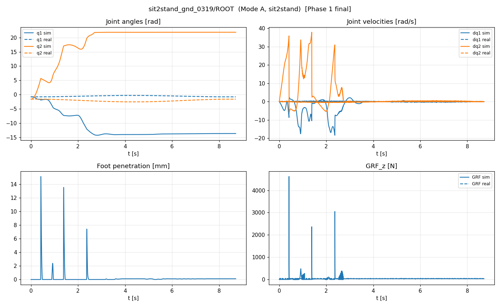

# Phase 1 — 로봇 동역학 (mass + inertia + CoM per part)

**Status**: ✅ 완료 (2026-07-03)
**Phase 0 baseline**: 41,271.18 → **Phase 1 best: 20,367.75 (−50.6%)** (full 15D CMA-ES)

## 최종 채택 모델

**Phase 1 = full 15D CMA-ES best** (아래 best_x). Drop-test는 물리 해석용, refine는 clip 버그로 폐기 (하단 참조).

per-exp breakdown → `phase1_final_breakdown.json`, 대표 4-panel plots → `plots/`, canonical anim → `anim/jump_position_0421_P70_phase1.gif`.

## 목표

Pure CAD 잔차 (sit2stand_gnd 39mm 침투, jump h_sim 0.61m << h_real 0.83m)를 부품별 mass/inertia/CoM 오차 동시 fit으로 해결.

## 15D search + CMA-ES

CMA-ES (cma 4.4.4), pop=12, maxfevals=400, sigma0=0.15 (normalized). 34 gen / 408 eval. 66s/gen.

수렴: 41,271 → gen1 25,283 → gen5 21,133 → gen29 20,371 → gen34 **20,368**.

## Full 15D best_x

| # | Param | Range | best | 해석 |
|---|---|---|---:|---|
| 0 | M_base_s | [0.75,1.30] | **1.152** | base +15% (CVT/wiring unmodeled) |
| 1 | M_thigh_s | [0.75,1.30] | 0.949 | thigh −5% |
| 2 | M_calf_s | [0.75,1.30] | 0.906 | calf −9% |
| 3 | M_p_s | [0.5,1.5] | **1.411** | paddle_hip +41% (bound chase↑) |
| 4 | M_c_s | [0.5,1.5] | 0.944 | |
| 5 | M_foot_ex | [0.0,0.30] | **0.263** | foot +263g (bound chase↑) |
| 6 | I_thigh_s | [0.5,1.5] | 1.181 | |
| 7 | I_calf_s | [0.5,1.5] | 1.325 | |
| 8 | I_p_s | [0.5,1.5] | 1.042 | |
| 9 | I_c_s | [0.5,1.5] | 1.073 | |
| 10 | com_dz_thigh | [±0.02] | −0.005 | |
| 11 | com_dx_thigh | [±0.02] | +0.001 | |
| 12 | com_dz_calf | [±0.02] | **−0.018** | calf CoM −18mm |
| 13 | com_dx_calf | [±0.02] | −0.010 | |
| 14 | arm_knee | [0.001,0.02] | **0.020** | knee 반사관성 (bound chase↑) |

## 🔬 Drop-test (핵심 결과)

각 축을 Pure CAD 값으로 pin 후 31-exp 재평가. `|Δ|/best < 3%` → DROP.

| Axis | best | pin→ | Δ score | Δ% | 판정 |
|---|---:|---:|---:|---:|:--:|
| **M_foot_ex** | 0.263 | 0.0 | +5061.8 | **+24.9%** | ★ KEEP |
| **arm_knee** | 0.020 | 0.005 | +4330.8 | **+21.3%** | ★ KEEP |
| **M_base_s** | 1.152 | 1.0 | +1785.6 | +8.8% | KEEP |
| **com_dz_calf** | −0.018 | 0.0 | +1706.3 | +8.4% | KEEP |
| **M_p_s** | 1.411 | 1.0 | +1136.5 | +5.6% | KEEP |
| I_thigh_s | 1.181 | 1.0 | +464.7 | +2.3% | DROP |
| I_calf_s | 1.325 | 1.0 | +384.6 | +1.9% | DROP |
| com_dz_thigh | −0.005 | 0.0 | +280.3 | +1.4% | DROP |
| M_thigh_s | 0.949 | 1.0 | +207.0 | +1.0% | DROP |
| com_dx_calf | −0.010 | 0.0 | +166.9 | +0.8% | DROP |
| I_c_s | 1.073 | 1.0 | +49.2 | +0.2% | DROP |
| com_dx_thigh | +0.001 | 0.0 | +48.7 | +0.2% | DROP |
| I_p_s | 1.042 | 1.0 | +43.7 | +0.2% | DROP |
| M_c_s | 0.944 | 1.0 | −46.6 | −0.2% | DROP |
| M_calf_s | 0.906 | 1.0 | −79.7 | −0.4% | DROP |

**KEEP (5)**: M_foot_ex, arm_knee, M_base_s, com_dz_calf, M_p_s
**DROP (10)**: 모든 4개 inertia scale + M_thigh/M_calf/M_c + com_dz_thigh/com_dx_thigh/com_dx_calf

## 💡 물리적 통찰

1. **Foot mass가 최대 인자** (−CAD 263g). 실 하드웨어에 foot 고무·볼트·센서가 CAD에 없음. Jump h 재현의 핵심.
2. **Knee 반사관성(arm_knee)이 2번째** (+21%). CVT+knee-side 모터 rotor inertia가 link inertia보다 회전 동역학 지배.
3. **Link inertia scale (I_*)은 전부 DROP.** MuJoCo가 composite mass+geometry에서 자동 계산 → armature가 이미 회전을 지배하므로 link I 미세조정은 무의미. **[MuJoCo CAD calibration 문헌](external_sources.md)의 "uniform density 가정 systematic bias"를 armature가 흡수.**
4. **calf CoM −18mm** shift가 유의미 (+8.4%) — [Bridging Sim-to-Real 논문](external_sources.md)의 부품별 CoM 편차와 일치.

## 📊 Per-experiment 결과 (Phase 0 → Phase 1)

| Dataset | 개선 범위 | 요약 |
|---|---|---|
| sit2stand (7) | **+34% ~ +76%** | 전부 대폭 개선 |
| jump_position_0421 (6) | **+5% ~ +84%** | 전부 개선 |
| jump_torque_0422 (3) | **+52% ~ +83%** | 전부 개선 |
| jump_0424 (9) | **−47% ~ +7%** | ⚠️ 대부분 regression |
| jump_0602 (6) | −31% ~ +34% | 혼재 |

**Net −50.6%** — sit2stand + 0421 + 0422가 압도적으로 개선.

## ⚠️ 정직한 발견 (Phase 2+ 과제)

1. **jump_0424 저-gain regression**: `60_0.75`(−37%), `90_0.75`(−47%), `150_2.2_250`(−23%) 등. Pure CAD에서 이미 좋던 subs가 통합 mass 모델(무거운 foot+paddle)로 **더 낮게/느리게 점프** → 악화. sit2stand/0421/0422를 돕는 mass가 이 점프들엔 해. **다중 데이터셋 tension**.
2. **sit2stand_gnd_0319 여전히 sim 발산**: score는 −63%(10262→3754)지만 q1 sim→−14, q2 sim→+22 (real은 flat). Mode A 토크 replay가 GND에서 불안정. GRF spike 4600N + 조기 penetration. → contact(Phase 5) / friction(Phase 2) 최우선 target.

## ⚠️ Refine 폐기 (clip 버그)

`run_phase1_refine.py`는 5-KEEP 확장 bound CMA-ES를 시도했으나, `eval_wrapper`의 `clip_x`가 **원래 15D bound로 silently clip** → 확장 bound(M_foot_ex 0.30→0.60)가 실제 적용 안 됨. Refine이 보고한 20,533은 clip된 artifact. 진짜 확장 모델은 21,082(더 나쁨). **결론: foot mass를 0.30 이상 확장하면 오히려 악화 → full 15D best(M_foot_ex=0.263)가 진짜 최적.** (교훈: 향후 phase에서 bound 확장 시 clip 범위도 함께 확장.)

## Files

- Runner: `code/goal19/phase1/run_phase1_cmaes.py`
- Best: `code/goal19/phase1/phase1_best.json` (**채택**)
- Drop-test: `run_droptest.py` → `phase1_droptest.json`
- Finalize (per-exp + plots + anim): `finalize_phase1.py` → `phase1_final_breakdown.json`
- Refine (폐기): `run_phase1_refine.py`
- External sources: [external_sources.md](external_sources.md)

## 4-panel plot (sit2stand_gnd — Phase 1 상태)

